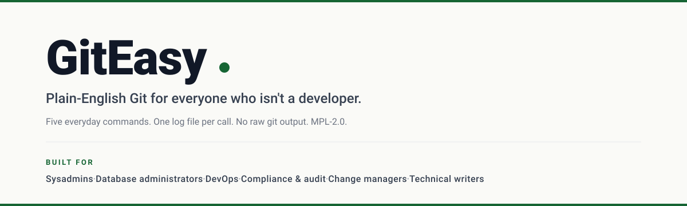

# GitEasy



A PowerShell module that lets a Git-clueless person save and publish their work without learning Git jargon.

## From Keith

I'm Keith Ramsey. For a living, I'm a SQL Server database administrator, and in my spare time, I'm a massive PowerShell enthusiast. For the past thirteen years, I've worked on the same team, quietly building internal tools to solve our specific headaches. GitEasy is a new chapter for me. It's the first tool I've ever released to the public, and honestly, the process of designing for strangers—polishing the code, writing in plain English just to be helpful—has been an absolute blast.

If you're checking out this module, I don't just hope you like it—I hope it gives you a sense of **relief**. I'll admit it: Git used to scare me. I've messed up commits, walked away from my desk in frustration, and told myself I'd figure it out tomorrow. While full-time developers breeze through Git, I work alongside DBAs, compliance teams, and change managers. We're the folks who just want our old TFS check-ins back. Git isn't just a tool; it's a whole new vocabulary filled with traps.

For a long time, we managed to avoid it. But eventually, the mandate came down: Git is here, learn it. Sitting there, feeling like I was studying for a final exam just to save a file, the concept for GitEasy clicked. What if we could strip away the jargon? What if checking in code didn't require an entirely new vocabulary?

Enter GitEasy. Just five simple commands. No confusing raw Git text. One log file per action. It's a frictionless wrapper—if you know Git, you can bypass it anytime. If you don't, you'll never need to see the scary stuff.

One important note: for now, I'm the only one making changes to GitEasy. Setting up the right legal paperwork to accept code changes from other people involves a lawyer, and I'd rather put my time and money into shipping more useful code than into legal forms I might have to redo. It's not a permanent stance; I'm just taking it slow. But rest assured, GitEasy is licensed under MPL 2.0, which means anyone is free to pick up the code and continue with it on their own. The project's survival doesn't depend on me.

I completely understand if that decision gives you pause. I'm just a guy figuring out the open-source world one step at a time. The door isn't bolted, it's just closed for today. I am fully open to bug reports and feature ideas — head to the GitHub project and open an [Issue](https://github.com/greenmtnsun/GitEasy/issues), tell me what you need, and I'll read it. No code necessary. If you want to chat, find me at [@greenmtnsun](https://github.com/greenmtnsun) on GitHub.

> *If you've ever closed PowerShell because the Git error message felt scarier than the change you were trying to save: this was built for you. I hope it brings some relief — and that you enjoy using it. Take care.*

## Notes

Short status notes from Keith. Newest at top. Edit / extend as the project moves.

### 2026-05-22 — Direction for CI and AI-agent users has its own page

Added [`docs/USING-IN-CI-AND-AGENTS.md`](docs/USING-IN-CI-AND-AGENTS.md). It's a single contract for anyone who wants to use GitEasy from a CI pipeline (GitHub Actions, Azure Pipelines, GitLab) or an AI coding agent. Deliberately does **not** ask consumers to run my own test suite or jargon audit — those are my quality bars, not theirs.

### 2026-05-22 — Contribution door is closed for now

No CLA in place; I'm not investing in legal until there's a real reason to. Bug reports as Issues are welcome. PRs won't be reviewed. When that changes, this note will say so.

### 2026-05-21 — v1.5.3 staged, holding the PowerShell Gallery publish

1.5.3 is feature-complete, manifest-ready (icon, in-repo LicenseUri, inline plaintext release notes, 14 audience-tagged keywords), and the `.nupkg` builds cleanly with per-doc PDFs included. I'm holding the actual PSGallery publish until I decide whether to flip the repo to public. The first outside user (Tycro) is installing from a private-repo clone right now — that's working fine.

### 2026-05-20 — Security review pass complete (v1.5.2)

Three credential-surface findings closed (F-04 / F-05 / F-06) covering sibling-pattern bugs the 1.5.1 review missed. Full kill-test suite added in `Tests/GitEasy.AuthHardening.Tests.ps1`. If you're using GitEasy with a credential helper, you want at least 1.5.2.

## What it gives you

A small set of plain-English commands. The complicated stuff stays inside the engine; what you see and type stays simple.

```powershell
Find-CodeChange         # What has changed?
Save-Work 'fix readme'  # Save and publish in one step.
Show-History            # Recent saved points.
Show-Remote             # Where this folder is published.
```

When something goes wrong, you get a plain-English message and a path to a self-contained log file with the technical detail. No raw Git output is ever shown to the user.

## Install

Friend-fast install (PS 5.1 and PS 7, no admin needed):

```powershell
$Edition = if ($PSVersionTable.PSEdition -eq 'Core') { 'PowerShell' } else { 'WindowsPowerShell' }
$ModuleDir = Join-Path $HOME "Documents\$Edition\Modules\GitEasy"
git clone https://github.com/greenmtnsun/GitEasy.git $ModuleDir
Import-Module GitEasy
```

That drops GitEasy into your user-scope PowerShell module folder
(which is on `$env:PSModulePath` by default), so
`Import-Module GitEasy` works from anywhere. See
[`docs/HOW-TO-USE-GITEASY.md`](docs/HOW-TO-USE-GITEASY.md) for the
offline-install path and all-users scope.

Once a PowerShell Gallery release lands, the install becomes:

```powershell
Install-Module GitEasy -Scope CurrentUser
```

The PowerShell Gallery page (when published) will be at
[**powershellgallery.com/packages/GitEasy**](https://www.powershellgallery.com/packages/GitEasy).

## Quickstart

```powershell
# In any folder that is already a Git repo:
Find-CodeChange
Save-Work 'first save'
Show-History -Count 5
```

If the repo has not been published anywhere yet, Save-Work will tell you so and save locally. When you connect a published location later, the next Save-Work will publish everything you have saved up to that point.

## The full command surface

| Command | What it does |
|---|---|
| `Find-CodeChange` | Show what has changed in your project folder. |
| `Save-Work` | Save changes and publish them (or save locally with `-NoPush`). |
| `Show-History` | Show recent saved points. |
| `Show-Remote` | Show where the project folder is published. |
| `Show-Diagnostic` | Open or list the diagnostic log files. |
| `New-BugReport` | Open a pre-filled GitHub bug report in your browser. |
| `Enable-GitEasy` | Make GitEasy load automatically every session. |
| `Disable-GitEasy` | Stop GitEasy from loading automatically. |
| `New-WorkBranch` | Start a new working area for an isolated task. |
| `Switch-Work` | Switch to another existing working area. |
| `Restore-File` | Restore a single file to its last saved state. |
| `Undo-Changes` | Throw away unsaved changes (requires `-Force` or `-Confirm`). |
| `Clear-Junk` | List or remove obvious temporary files. |
| `Test-Login` | Verify connectivity to the published location. |
| `Set-Token` | Configure HTTPS-based login. |
| `Set-Ssh` | Configure SSH-based login. |
| `Set-Vault` | Choose where saved logins are stored. |
| `Get-VaultStatus` | Report the configured credential helper. |
| `Reset-Login` | Forget the saved login so it can be set up again. |

Each command has full comment-based help — `Get-Help <Command> -Full` for the friendly version.

## Diagnostic logs

Every public command writes a small log file under `%LOCALAPPDATA%\GitEasy\Logs`. Successful runs log silently. Failures throw a plain-English message and tell you the log path so a Git-aware person can read what happened.

```powershell
Show-Diagnostic           # Open the most recent log.
Show-Diagnostic -List     # List recent logs.
Show-Diagnostic -All      # Open the logs folder.
```

Logs older than 30 days are pruned automatically.

## Documentation

The full documentation lives in the [GitHub Wiki](https://github.com/greenmtnsun/GitEasy/wiki). Every public command has its own page with synopsis, examples, safety notes, and a related-commands cross-reference. Every private helper has a similar page for maintainers.

## Compatibility

- **Windows PowerShell 5.1+**
- **PowerShell 7+** (Windows; cross-platform may work but is not the design target)
- **Git** must be installed and on `PATH`.

Running GitEasy from a CI job or an AI agent? See [`docs/USING-IN-CI-AND-AGENTS.md`](docs/USING-IN-CI-AND-AGENTS.md) — one-page contract for consumers.

## Status

GitEasy is at **1.6.0** — plain-English public surface (24 commands), Pester tests on both PowerShell hosts, and full plain-English contract.

See [CHANGELOG.md](CHANGELOG.md) for the history.

## Contributing

GitEasy is maintained by a single author and is **not currently accepting outside pull requests** — no contributor agreement is in place. Bug reports as [Issues](https://github.com/greenmtnsun/GitEasy/issues) are welcome.

The author's quality bar (test discipline, no-jargon rule, diagnostic-log session pattern) is documented in [CONTRIBUTING.md](CONTRIBUTING.md) for transparency.

## License

[Mozilla Public License 2.0](LICENSE). File-level copyleft: anyone can use, modify, and embed this code in proprietary or open projects, but modifications to GitEasy's own files must be released under MPL-2.0.

## Author

Keith Ramsey ([@greenmtnsun](https://github.com/greenmtnsun)).
