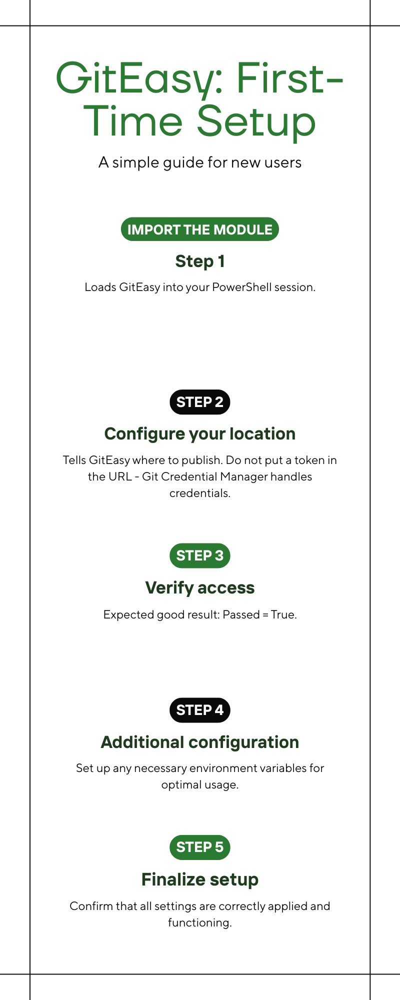
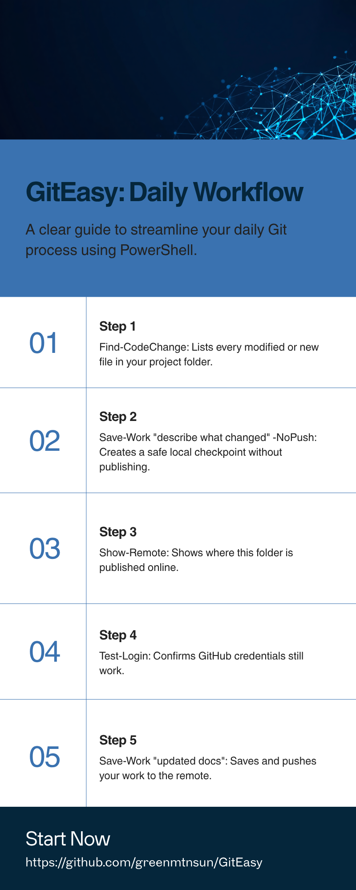
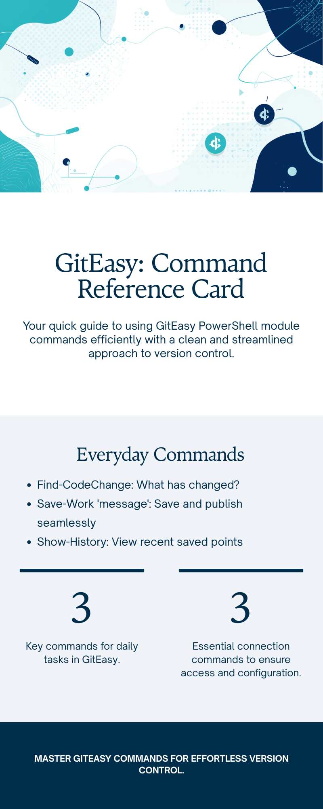

# How to Use GitEasy

A practical, top-to-bottom how-to for the **GitEasy** PowerShell module: the
five commands you will use every day, the three commands you run once to
configure GitHub access, and the recovery commands you will be glad to find
when something goes wrong.

GitEasy gives you plain-English commands that wrap Git. You never see raw
Git output. If something fails, you get a friendly message and a path to a
diagnostic log.

---

## Visual references

Three Canva infographics accompany this guide. The view links open the
designs in Canva. PNG exports are intended to live in `docs/images/` and
embed inline below; export each design from Canva and drop the PNG into
that folder to make the inline previews render.

| Figure | Title | Canva view | Inline file |
|---|---|---|---|
| 1 | First-Time Setup | https://www.canva.com/d/ZeajQux9lX2yMKP | `docs/images/first-time-setup.png` |
| 2 | Daily Workflow | https://www.canva.com/d/lzVDVWdVfdDutV4 | `docs/images/daily-workflow.png` |
| 3 | Command Reference Card | https://www.canva.com/d/TYMcRP3_CVNpmwL | `docs/images/command-reference.png` |

---

## 1. Prerequisites

- **Windows PowerShell 5.1** or **PowerShell 7+**.
- **Git** installed and on `PATH`. Verify with `git --version`.
- A folder that is already a Git repository (it has a `.git` subfolder).

## 2. Install (import) the module

GitEasy is a local-install module. Clone or copy the folder somewhere
convenient, then import the manifest:

```powershell
Import-Module 'C:\Sysadmin\Scripts\GitEasy\GitEasy.psd1' -Force
Get-Command -Module GitEasy
```

`-Force` reloads the module if it was already imported. `Get-Command` lists
every public command so you can confirm the import worked.

## 3. First-time setup



The first time you point GitEasy at a repo, do these three things in order:

### 3.1 Tell GitEasy where to publish

```powershell
Set-Token -RemoteUrl 'https://github.com/<you>/<your-repo>.git'
```

This configures the `origin` remote over HTTPS. **Do not put a token in the
URL.** Git Credential Manager handles credentials for you.

### 3.2 Pick a credential helper

```powershell
Set-Vault -Helper manager
Get-VaultStatus
```

`Set-Vault -Helper manager` uses Git Credential Manager (the standard
Windows credential vault). `Get-VaultStatus` reports back which helper is
configured.

### 3.3 Verify access

```powershell
Test-Login
```

Expected good result:

```text
Passed  : True
Message : Remote login/connectivity test passed.
```

If `Passed = False`, run `Show-Diagnostic` to open the most recent log and
read what happened in plain English.

## 4. The daily workflow



This is the loop you will repeat every day. Five commands, in order.

### 4.1 See what changed

```powershell
Find-CodeChange
```

Lists every modified, staged, and untracked file. Run this before saving so
you know what is about to be committed.

### 4.2 Save locally (a safe checkpoint)

```powershell
Save-Work 'describe what changed' -NoPush
```

`-NoPush` records the change locally without publishing. Use it when you
are mid-task and want a rollback point before continuing.

### 4.3 Check where you publish to

```powershell
Show-Remote
```

Shows the configured publish location and the current branch. Run this if
you are unsure which repository or branch you are about to push to.

### 4.4 Verify your login still works

```powershell
Test-Login
```

A quick connectivity check. Cheaper than discovering a stale token
mid-push.

### 4.5 Publish

```powershell
Save-Work 'updated docs'
```

Without `-NoPush`, `Save-Work` stages, commits, pulls peer updates, replays
your work on top, and pushes. One command, three Git operations, no raw Git
output.

#### First push for a new branch

```powershell
Save-Work 'first remote checkpoint' -SetUpstream
```

`-SetUpstream` sets up the tracking link so later `Save-Work` calls know
where to push.

#### Bumping a module version while you save

```powershell
Save-Work 'Add Search-History' -BumpVersion -BumpKind Minor
```

Finds the `.psd1` manifest in your project, bumps the version (Major /
Minor / Build / Revision), and prefixes the saved-point message with the
new version number.

### 4.6 Look back at recent saves

```powershell
Show-History -Count 5
```

Shows the last five saved points with author, date, and message. Bump
`-Count` to see more.

## 5. Command reference



| Command | What it does |
|---|---|
| `Find-CodeChange` | Show what has changed in your project folder. |
| `Save-Work` | Save changes and publish them (or save locally with `-NoPush`). |
| `Show-History` | Show recent saved points. |
| `Show-Remote` | Show where the project folder is published. |
| `Show-Diagnostic` | Open or list the diagnostic log files. |
| `New-WorkBranch` | Start a new working area for an isolated task. |
| `Switch-Work` | Switch to another existing working area. |
| `Restore-File` | Restore a single file to its last saved state. |
| `Undo-Changes` | Throw away unsaved changes (requires `-Force` or `-Confirm`). |
| `Clear-Junk` | List or remove obvious temporary files. |
| `Test-Login` | Verify connectivity to the published location. |
| `Set-Token` | Configure HTTPS-based login. |
| `Set-Ssh` | Configure SSH-based login. |
| `Set-Vault` | Choose where saved logins are stored. |
| `Get-VaultStatus` | Report the configured credential helper. |
| `Reset-Login` | Forget the saved login so it can be set up again. |

Every command has full comment-based help:

```powershell
Get-Help Save-Work -Full
Get-Help Save-Work -Examples
```

## 6. Recovery: when something goes wrong

### 6.1 Restore one file

```powershell
Restore-File README.md
```

Pulls a single file back to its last saved state. Other modified files are
not touched.

### 6.2 Throw away all unsaved changes

```powershell
Undo-Changes -Force
```

Discards every uncommitted change in the working tree. `-Force` is
required because this is destructive. Use `-Confirm` if you want a prompt
instead.

### 6.3 Clear obvious temporary files

```powershell
Clear-Junk        # list what would be removed
Clear-Junk -Force # actually remove them
```

### 6.4 Fix a bad cached HTTPS credential

```powershell
Reset-Login
Test-Login
```

`Reset-Login` tells Git to reject the cached credential so Git Credential
Manager prompts you again on the next push.

### 6.5 Switch a repo to SSH

```powershell
Set-Ssh
Show-Remote
Test-Login
```

Only use SSH if you have already configured an SSH key with GitHub.

### 6.6 Read the diagnostic log

Every public command writes a self-contained log under
`%LOCALAPPDATA%\GitEasy\Logs`. Successful runs log silently. Failures throw
a plain-English message **and** the log path.

```powershell
Show-Diagnostic         # open the most recent log
Show-Diagnostic -List   # list recent logs
Show-Diagnostic -All    # open the logs folder
```

Logs older than 30 days are pruned automatically.

## 7. Worked example: a complete session

```powershell
# Load the module.
Set-Location C:\Sysadmin\Scripts\GitEasy
Import-Module .\GitEasy.psd1 -Force

# What changed today?
Find-CodeChange

# Take a safety checkpoint.
Save-Work 'checkpoint before refactor' -NoPush

# Refactor your code in your editor, then re-check.
Find-CodeChange

# Confirm where we publish to and that login is healthy.
Show-Remote
Test-Login

# Save and publish.
Save-Work 'Refactor public command parameter handling'

# Confirm the new save landed.
Show-History -Count 3
```

## 8. Where to go next

- `docs/QUICKSTART.md` — minimum keystrokes to get going.
- `docs/COMMAND_EXAMPLES.md` — one-line example for every command.
- `Examples/` — runnable PowerShell scripts numbered 00–10 covering state
  checks, HTTPS setup, SSH switch, credential reset, and a daily-workflow
  driver.
- `Get-Help <Command> -Full` — comment-based help for any public command.
- [GitEasy Wiki](https://github.com/greenmtnsun/GitEasy/wiki) — the long
  reference, one page per command.
